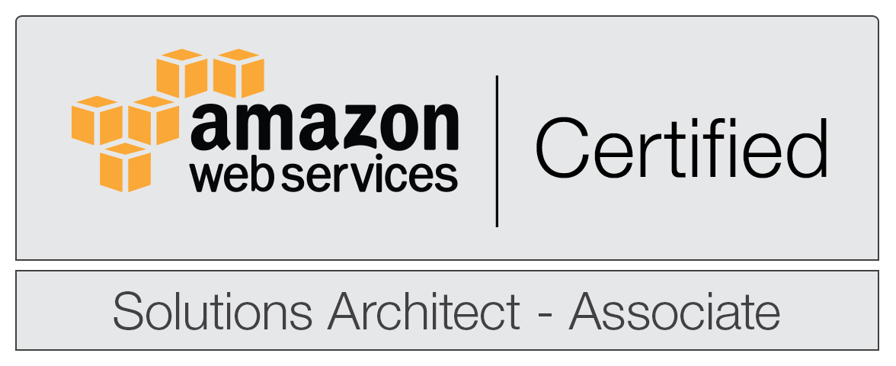
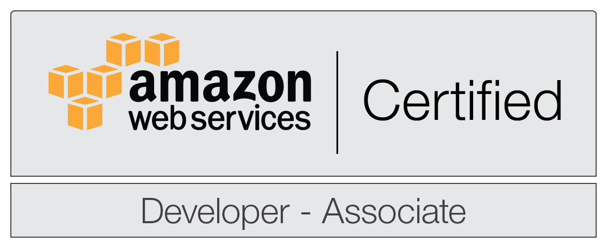
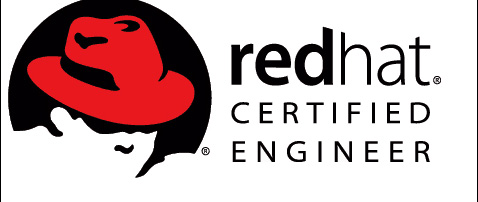

Hi, my name is Thinegan Ratnam and I’m a Cloud Engineer based in [**Kuala Lumpur**](https://www.lonelyplanet.com/malaysia/kuala-lumpur){:target="_blank"}, Malaysia.

I was born and brought up in Petaling Jaya, Selangor.
I studied Bachelors of Computer Science (Software Engineering) at the [**University Malaya**](https://en.wikipedia.org/wiki/University_of_Malaya){:target="_blank"}.
After graduating I focus my direction into web development, security and system administration.

I currently work as a Head of IT Infrastructure at [**Moneylion Inc**](https://www.moneylion.com/){:target="_blank"} in a branch office in Kuala Lumpur,
a position that sees me working with US based companies.

For more information about what I do and have done, check out my projects page.
If you’d like to get in touch, email me at [thinegan@thinegan.com](mailto:thinegan@thinegan.com).

<figure class="third">
	
	
	
	
	
</figure>

